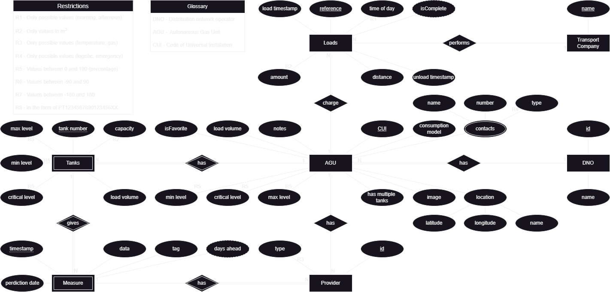
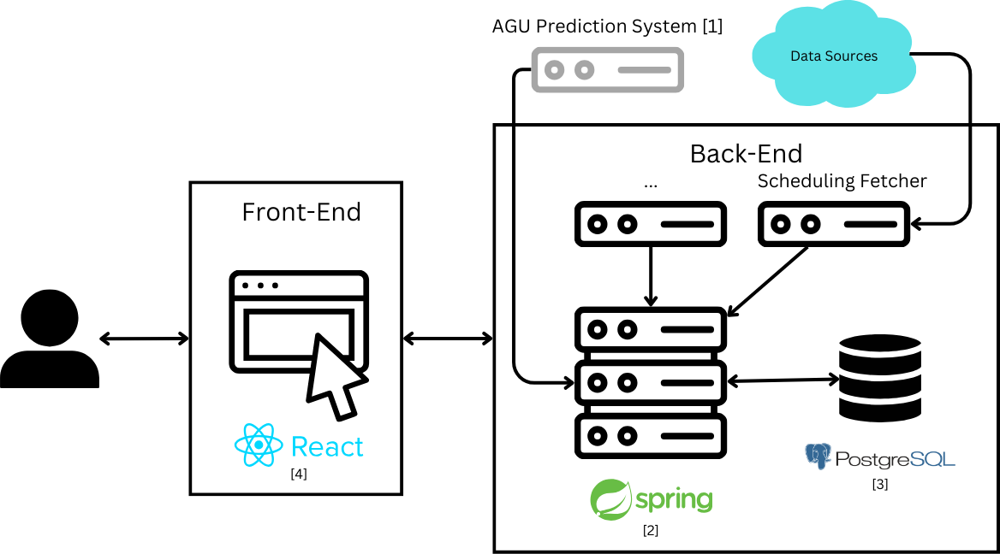

# AGU Data System - Backend Documentation

## Table of Contents

- [Introduction](#introduction)
- [Modeling the Database](#modeling-the-database)
    - [Conceptual Model](#conceptual-model)
    - [Physical Model](#physical-model)
- [Application Architecture](#application-architecture)
    - [Controller Layer](#controller-layer)
    - [Service Layer](#service-layer)
    - [Repository Layer](#repository-layer)
    - [Data Representation](#data-representation)
- [Error Handling](#error-handling)
- [Running the application](#running-the-application)


## Introduction

This document provides an overview of the backend system of the AGU Data System and its conception. 
The backend system is responsible for managing the data and the business logic of the AGU Data System,
communicating with the fetching module and frontend system,
and providing the necessary APIs for the frontend system to interact with the backend system.
The backend system is implemented using the Kotlin programming language and the Spring Boot framework.

## Modeling the Database

### Conceptual Model

The following diagram holds the Entity-Relationship diagram for the information managed by the backend system.



### Physical Model

The physical model of the database is available in [create-tables.sql](../sql/create-tables.sql).

To implement and manage the database, PostgresSQL was used.

The [`code/sql`](../sql) folder contains all SQL scripts developed:

- [create-tables.sql](../sql/create-tables.sql) — Creates the database schema;
- [delete-tables.sql](../sql/delete-tables.sql) — Deletes the database schema;
- [drop-tables.sql](../sql/drop-tables.sql) — Drops the database schema;
- [insert-some-agus.sql](../sql/insert-some-agus.sql) - Inserts some AGUs into the database as test doubles;

## Application Architecture



The application is structured as follows:

- [/domain](src/main/kotlin/aguDataSystem/server/domain) - Contains the domain classes of the application;
- [/http](src/main/kotlin/aguDataSystem/server/http) - Contains the controller layer of the application
  using Spring Web MVC;
- [/service](src/main/kotlin/aguDataSystem/server/service) - Contains the service layer of the application;
- [/repository](src/main/kotlin/aguDataSystem/server/repository) - Contains the data access layer of the
  application using JDBI;
- [/utils](src/main/kotlin/aguDataSystem/utils) - Contains utility classes.

### Controller Layer

The controller layer is responsible for handling the HTTP requests, processing them and giving back a response; witch is
annotated with the `@RestController` and `@RequestMapping`.
The methods are annotated with `@GetMapping`, `@PostMapping` and `@DeleteMapping` depending on the request method.
The responses are returned as a JSON object (Output Models),
and the requests are received as a JSON object (Input Models).

The Controller Layer is organized as follows:

- [config](src/main/kotlin/aguDataSystem/server/http/config) - Contains the configuration class of the application;
- [controllers](src/main/kotlin/aguDataSystem/server/http/controllers) - Contains the controllers of the application.
  - [/agu](src/main/kotlin/aguDataSystem/server/http/controllers/agu) - Contains the controller for the AGU classes as 
  well as the input and output models.
    - [/models](src/main/kotlin/aguDataSystem/server/http/controllers/agu/models) - Contains the input and output models 
    for data operations.
  - [/media](src/main/kotlin/aguDataSystem/server/http/controllers/media) - Contains the Problem class for the errors 
  that are used in the application.

### Service Layer

The service layer is responsible for the business logic of the application.
It is the intermediary between the controller and the repository layer.
It receives the requests from the controller layer, processes and sends them to the repository layer,
returning the response to the controller layer.
These responses can be one of two types:

- **Domain Objects**: If the operation only has one thing that can go wrong, we send to the controller the domain object
  or null;
- **Results**: If the operation can have multiple things that can go wrong, we send to the controller a result object.

The Service Layer is organized as follows:

- [services](src/main/kotlin/aguDataSystem/server/service) - Contains the services of the application;
  - [/agu](src/main/kotlin/aguDataSystem/server/service/agu) - Contains the service for the AGU classes and its possible results;
  - [/chron](src/main/kotlin/aguDataSystem/server/service/chron) - Contains the service for the automatic polling of data from the fetching module;
  - [/errors](src/main/kotlin/aguDataSystem/server/service/errors) - Contains the possible errors that can occur in the application on the service layer.


### Repository Layer

The repository layer is responsible for the data access of the application,
receiving the requests from the service layer,
processing them and sending them to the database, returning the response to the service layer.
The data is represented used in this layer is the domain model itself.

This layer is designed to use a [JDBI interface](https://jdbi.org/) to access the database,
but it can be easily changed to use another database access library.

This layer is organized as follows:

- [repositories](src/main/kotlin/aguDataSystem/server/repository) - Contains all the repositories of the application;
  - [/agu](src/main/kotlin/aguDataSystem/server/repository/agu) - Contains the repository for the AGU classes;
  - [/contact](src/main/kotlin/aguDataSystem/server/repository/contact) - Contains the repository for the contact classes;
  - [/dno](src/main/kotlin/aguDataSystem/server/repository/dno) - Contains the repository for the DNO classes;
  - [/gas](src/main/kotlin/aguDataSystem/server/repository/gas) - Contains the repository for the gas classes;
  - [/jdbi](src/main/kotlin/aguDataSystem/server/repository/jdbi) - Contains the JDBI configuration class;
    - [/mappers](src/main/kotlin/aguDataSystem/server/repository/jdbi/mappers) - Contains the mappers for the domain classes;
  - [/provider](src/main/kotlin/aguDataSystem/server/repository/provider) - Contains the repository for the provider classes;
  - [/tank](src/main/kotlin/aguDataSystem/server/repository/tank) - Contains the repository for the tank classes;
  - [/temperature](src/main/kotlin/aguDataSystem/server/repository/temperature) - Contains the repository for the temperature classes;

### Data Representation

- **Domain Model**: The domain model is the representation of the data in the application.
  It is used across all layers of the application.
- **Input/Output Models**: The input and output models are the representation of the data received and sent in the
  requests.
  They are used exclusively in the controller layer.

## Error Handling

No error handling was implemented in the controller layer,
as the Spring Boot framework handles the exceptions and returns a Bad Request response.

## Running the application

To run the application, you need to have the following installed:

- [Gradle](https://gradle.org/)
- [Java 17](https://www.oracle.com/java/technologies/javase-jdk17-downloads.html)
- [Docker](https://www.docker.com/)

With the Gradle wrapper, you can build the application with the following command on the [jvm folder](./../jvm):

```shell
./gradlew build
```

Alternatively, it's possible to deploy the application using Docker and not Java, with the following steps:

```shell
  docker compose up -d --build --force-recreate
```